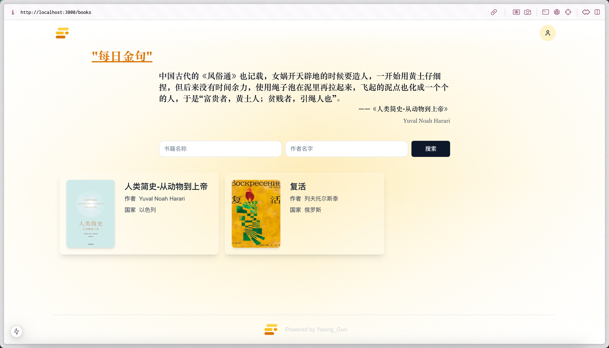
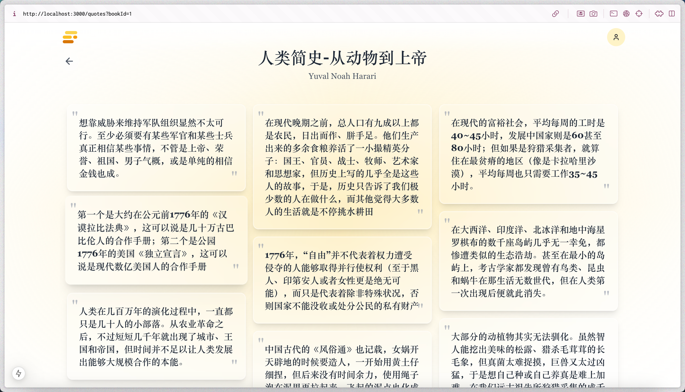
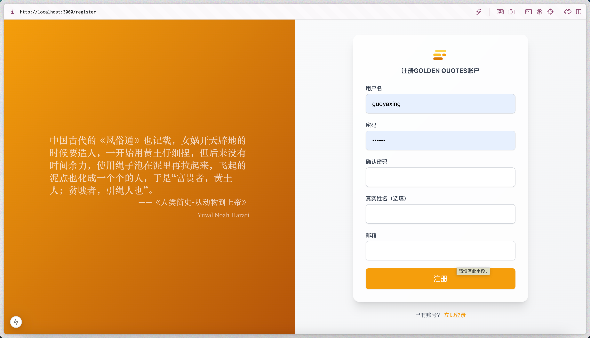
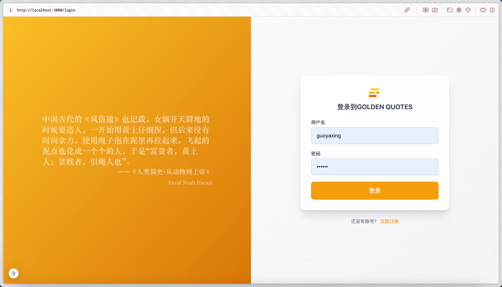
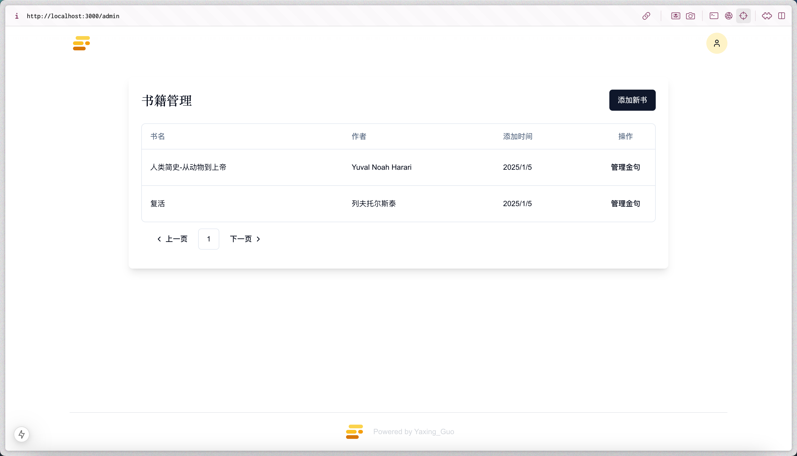
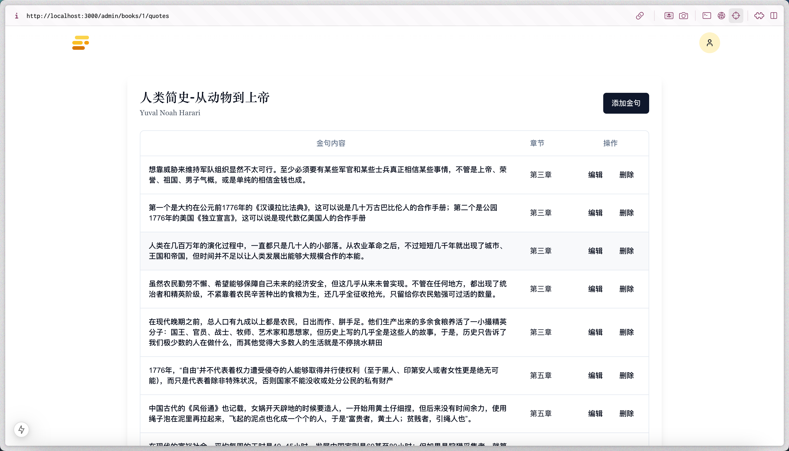
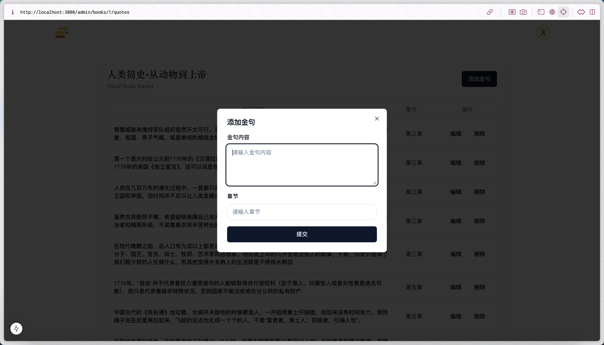

# GOLDEN QUOTES
> 发现、收藏并分享最珍贵的文字瞬间

## 功能设计
- 书籍及金句展示功能
- 书籍及金句管理功能
- 金句收藏功能(目前接口已实现，页面尚未实现) user 和 quotes 多对多关系，借助redis实现异步同步金句收藏数；
- 注册、登录功能(SaToken) 结合satoken实现注册和登录功能；
- 接口角色鉴权(SaToken) 结合satoken的鉴权功能，实现不同角色的权限控制。
- 每日金句,通过redis缓存加定时任务刷新，实现每天零点刷新接口内容，固定数据并且避免频繁访问数据库;
## 技术选型
- SpringBoot
- MySQL
- MyBatis Plus
- SaToken
- Redis
- RESTful API
- MAVEN
- Next.js
## 页面展示
- 书籍展示页

- 金句展示页

- 注册页

- 登录页

- 书籍管理页

- 金句管理页

- 收藏页(todo)

## todos
- [] 检查已收藏金句，在页面展示，渲染按钮
- [] 接入流光卡片API，实现金句分享功能（复制和下载图片）